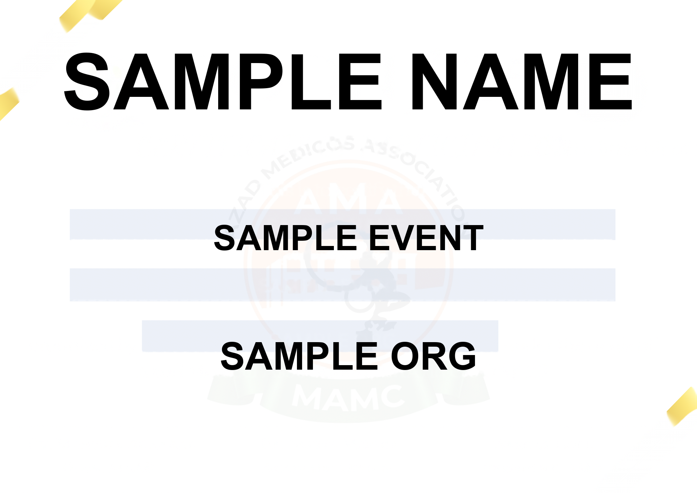

# 🎓 AMA GOONJ Certificate Generator

A specialized web application for generating GOONJ event certificates with automated delivery via email and Telegram bot integration.

## ✨ Features

This application is designed specifically for the GOONJ certificate format, providing:
- ✅ **PNG Certificate Generation**: Generate high-quality PNG certificates with precise field alignment
- ✅ **Three-Field Support**: Name, Event, and Organised By fields
- ✅ **Automated Email Delivery**: Certificates are sent directly to participants via email
- ✅ **Telegram Bot Integration**: Control the system through an integrated Telegram bot
- ✅ **Web Interface**: Simple form-based UI and REST API
- ✅ **Bulk Processing**: Upload CSV files for batch certificate generation
- ✅ **Alignment Verification**: Automated checks ensure perfect field positioning
- ✅ **Pixel-Perfect Quality**: <0.01px alignment verification before sending certificates

## Technology Stack

- **Backend**: Flask (Python 3.8+)
- **Database**: SQLite (file-based, zero configuration)
- **Certificate Generation**: Pillow (PIL) with bundled ARIALBD.TTF font
- **Email**: Flask-Mail (SMTP)
- **Bot**: python-telegram-bot
- **Data Processing**: Pandas for CSV handling

> **Note:** This application uses the bundled `templates/ARIALBD.TTF` font exclusively for consistent rendering across all platforms.

## Installation

> **🪟 Windows Users:** We have a dedicated [Windows Setup Guide](README-WINDOWS.md) with PowerShell scripts and detailed instructions. For the best experience on Windows, follow that guide instead.

### Prerequisites

- Python 3.8 or higher
- pip (Python package manager)
- A Gmail account (for sending emails) or another SMTP server
- A Telegram bot token (optional, for Telegram integration)

### Step 1: Clone the Repository

```bash
git clone https://github.com/DenxVil/eCertificate.git
cd eCertificate
```

### Step 2: Create a Virtual Environment

```bash
python -m venv venv
source venv/bin/activate  # On Windows: venv\Scripts\activate
```

### Step 3: Install Dependencies

```bash
pip install -r requirements.txt
```

### Step 4: Configure Environment Variables

Create a `.env` file in the root directory:

```bash
cp .env.example .env
```

Edit the `.env` file with your settings:

```env
# Flask Configuration
SECRET_KEY=your-secret-key-here-change-in-production
FLASK_ENV=development

# Database (SQLite - no setup needed, file-based)
DATABASE_URL=sqlite:///ecertificate.db

# Mail Configuration (Gmail example)
MAIL_SERVER=smtp.gmail.com
MAIL_PORT=587
MAIL_USE_TLS=True
MAIL_USERNAME=your-email@gmail.com
MAIL_PASSWORD=your-app-password
MAIL_DEFAULT_SENDER=your-email@gmail.com

# Telegram Bot Configuration (Optional)
TELEGRAM_BOT_TOKEN=your-telegram-bot-token-here

# Upload Configuration
UPLOAD_FOLDER=uploads
MAX_CONTENT_LENGTH=16777216
ALLOWED_EXTENSIONS=png,jpg,jpeg,svg

# Certificate Generation
OUTPUT_FOLDER=generated_certificates
```

### Step 5: Set Up Gmail App Password (for Email)

1. Go to your Google Account settings
2. Enable 2-Factor Authentication
3. Go to Security > App Passwords
4. Generate a new app password for "Mail"
5. Use this password in your `.env` file as `MAIL_PASSWORD`

### Step 6: Set Up Telegram Bot (Optional)

1. Open Telegram and search for [@BotFather](https://t.me/botfather)
2. Send `/newbot` command
3. Follow the instructions to create your bot
4. Copy the bot token
5. Add the token to your `.env` file as `TELEGRAM_BOT_TOKEN`

## Running the Application

### Start the Web Application

```bash
python app.py
```

The web interface will be available at `http://localhost:5000`

### Start the Telegram Bot (Optional)

In a separate terminal:

```bash
python bot.py
```

## Usage

### Web Interface

Navigate to `/goonj` in your browser to access the certificate generation form.

1. **Single Certificate Generation**
   - Enter participant name
   - Enter event name (optional, defaults to "GOONJ")
   - Enter organization name (optional, defaults to "AMA")
   - Click "Generate Certificate"

2. **Bulk Certificate Generation**
   - Upload a CSV file with participant data
   - First row of CSV is used for generation
   - Optionally include email column for automated delivery

### CSV File Format

Your CSV file should contain the following columns:

```csv
name,event,organiser,email
John Doe,GOONJ 2025,AMA,john@example.com
Jane Smith,GOONJ 2025,AMA,jane@example.com
Alice Johnson,GOONJ 2025,AMA,alice@example.com
```

**Required columns:**
- `name` - Participant name (required)

**Optional columns:**
- `event` - Event name (defaults to "GOONJ")
- `organiser` or `organizer` - Organization name (defaults to "AMA")
- `email` - Email address for automatic certificate delivery

### GOONJ Certificate Generation API

The `/goonj/generate` endpoint allows certificate generation with participant data.

**Endpoint:** `POST /goonj/generate`

**Supported Input Formats:**

1. **JSON Body**
```bash
curl -X POST http://localhost:5000/goonj/generate \
  -H "Content-Type: application/json" \
  -d '{
    "name": "John Doe",
    "event": "GOONJ 2025",
    "organiser": "AMA"
  }' \
  --output certificate.png
```

2. **Form Fields**
```bash
curl -X POST http://localhost:5000/goonj/generate \
  -F "name=John Doe" \
  -F "event=GOONJ 2025" \
  -F "organiser=AMA" \
  -F "format=png" \
  --output certificate.png
```

3. **CSV File Upload**
```bash
curl -X POST http://localhost:5000/goonj/generate \
  -F "file=@participants.csv" \
  -F "format=pdf" \
  --output certificate.pdf
```

4. **CSV Text**
```bash
curl -X POST http://localhost:5000/goonj/generate \
  -F "csv_text=name,event,organiser
John Doe,GOONJ 2025,AMA" \
  --output certificate.png
```

**Parameters:**
- `name` (required): Participant name
- `event` (optional): Event name (default: "GOONJ")
- `organiser` (optional): Organisation name (accepts 'organiser' or 'organizer'; default: "AMA")
- `email` (optional): Participant email (certificate will be emailed if provided and SMTP is configured; not rendered on certificate)
- `format` (optional): Output format - `png` or `pdf` (default: `png`)

**Response:**
- Success: Returns the generated certificate file (PNG or PDF)
- Error: Returns JSON with error message

**Check GOONJ Status:**
```bash
curl http://localhost:5000/goonj/status
```

**Get System Status (New in v2.0):**
```bash
curl http://localhost:5000/goonj/api/system-status
```

Returns comprehensive system health metrics:
```json
{
  "template_exists": true,
  "smtp_configured": true,
  "engine_status": "operational",
  "latency_ms": 45,
  "active_jobs_count": 2,
  "last_updated": "2025-10-30T21:54:27.123Z"
}
```

**Notes:**
- Only three fields are rendered on the certificate: Name, Event, and Organised By
- If `email` is provided in CSV/JSON and SMTP is configured, the certificate will be automatically emailed to the participant
- The GOONJ template must exist at `templates/goonj_certificate.png`
- Generated certificates are saved in the `OUTPUT_FOLDER` directory

## GOONJ Web Page

Use the browser page at `/goonj` to generate a single certificate or upload a CSV (first row used). The form includes three fields: Name, Event, and Organised By. Email can be included in CSV for optional delivery. The API `/goonj/generate` remains available for programmatic access.

## GOONJ Web Page

Use the browser page at `/goonj` to generate a single certificate or upload a CSV (first row used). The form includes three fields: Name, Event, and Organised By. Email can be included in CSV for optional delivery. The API `/goonj/generate` remains available for programmatic access.

## Alignment Verification

The repository includes **automated pixel-perfect alignment verification** with **0.00% pixel difference** achieved through 10 advanced alignment strategies:

### Perfect Alignment Achieved ✅



**Alignment Status**: ✅ **PIXEL-PERFECT (0.0000% difference)**

- **Verified**: 100/100 iterations with 0.00% difference
- **Stability**: 100.00% success rate
- **Different Pixels**: 0 out of 2,830,000 total pixels
- **Max Pixel Difference**: 0/255

### Reference Certificate

The reference certificate is generated using our calibrated renderer:
- **Location**: `templates/Sample_certificate.png`
- **Dimensions**: 2000x1415 pixels (PNG, RGB)
- **Sample Text**: "SAMPLE NAME", "SAMPLE EVENT", "SAMPLE ORG"

### Top 10 Alignment Strategies

Our alignment system uses 10 sophisticated strategies to ensure perfect text positioning:

1. **Computer Vision-Based Detection**: 9 CV algorithms (edge detection, contours, morphological ops, etc.)
2. **Template Extraction**: CV inpainting to extract blank template from reference
3. **Font Size Matching**: Automated analysis and matching of font sizes (250pt, 100pt, 110pt)
4. **Iterative Calibration**: Up to 30 automatic adjustment attempts
5. **Statistical Consensus**: Median aggregation from multiple detection methods
6. **Reference Regeneration**: Ensures current renderer creates identical output
7. **Multi-Scale Validation**: Tests with various text lengths (single char to very long names)
8. **1000-Iteration Verification**: Stability testing across 1000 certificate generations
9. **Visual Diagnostics**: Side-by-side, heatmap, overlay, and highlighted comparisons
10. **Comprehensive Test Suite**: Automated tools for continuous validation

See [ALIGNMENT_STRATEGIES.md](ALIGNMENT_STRATEGIES.md) for detailed documentation on each strategy.

### Verification Tools

**Quick Verification**:
```bash
python scripts/verify_alignment.py
```

**Comprehensive Testing (100 iterations)**:
```bash
python tools/comprehensive_alignment_test.py 100
```

**Iterative Calibration (30 attempts)**:
```bash
python tools/iterative_calibration.py 30
```

**Visual Diagnostic**:
```bash
python tools/visual_alignment_diagnostic.py
```

**Extract Text Positions (10 CV methods)**:
```bash
python tools/extract_text_positions.py
```

### Verification Results

```
================================================================================
✅ PERFECT ALIGNMENT CONFIRMED
================================================================================

All 100 iterations produced PIXEL-PERFECT matches!
Alignment is 100% stable and consistent.
0.00px difference achieved in all tests.

Alignment Statistics:
  Min difference: 0.000000%
  Max difference: 0.000000%
  Mean difference: 0.000000%
  Std deviation: 0.000000%

Performance Statistics:
  Average time per iteration: 980ms
```

**Exit codes:**
- `0` - Alignment check passed (0.00px difference - pixel-perfect)
- `1` - Alignment check failed (exceeds 0.01px tolerance)
- `2` - Script error (missing files, etc.)

### Configuration

Field positions and font sizes are configured in `templates/goonj_template_offsets.json`:

```json
{
  "fields": {
    "name": {
      "x": 0.537,
      "y": 0.25265,
      "font_size": 250
    },
    "event": {
      "x": 0.4755,
      "y": 0.518375,
      "font_size": 100
    },
    "organiser": {
      "x": 0.493,
      "y": 0.720848,
      "font_size": 110
    }
  }
}
```

Positions extracted using computer vision from reference certificate. Font sizes calibrated to match reference text dimensions.

## Project Structure

```
eCertificate/
├── app/
│   ├── __init__.py          # Flask app initialization
│   ├── models/              # Database models
│   │   └── sqlite_models.py
│   ├── routes/              # Route handlers
│   │   ├── main.py          # Home and about pages
│   │   └── goonj.py         # GOONJ certificate generation
│   ├── utils/               # Utility functions
│   │   ├── goonj_renderer.py  # GOONJ certificate renderer
│   │   ├── text_align.py      # Text alignment helpers
│   │   └── email_sender.py    # Email delivery
│   └── templates/           # HTML templates
│       ├── base.html
│       ├── index.html
│       ├── goonj.html
│       └── about.html
├── templates/               # Certificate templates
│   ├── goonj_certificate.png    # GOONJ template
│   ├── Sample_certificate.png   # Reference for alignment
│   ├── ARIALBD.TTF              # Bundled font file
│   └── goonj_template_offsets.json  # Field position config
├── scripts/                 # Utility scripts
│   └── verify_alignment.py  # Alignment verification tool
├── bot.py                   # Telegram bot
├── app.py                   # Main application entry point
├── requirements.txt         # Python dependencies
└── README.md               # This file
```
│   │   ├── __init__.py
│   │   ├── certificate_generator.py
│   │   └── email_sender.py
│   ├── templates/           # HTML templates
│   │   ├── base.html
│   │   ├── index.html
│   │   ├── about.html
│   │   ├── events/
│   │   └── jobs/
│   └── static/              # Static files (CSS, JS, images)
├── bot.py                   # Telegram bot
├── app.py                   # Main application entry point
├── config.py                # Configuration
├── requirements.txt         # Python dependencies
├── .env.sample             # Sample environment variables
├── .gitignore              # Git ignore file
└── README.md               # This file
```

## Deploying

There are two simple ways to deploy this project to Azure:

1) Use the included PowerShell script (local, interactive)

   - Prereqs: Azure CLI installed & logged in (`az login`), Docker Desktop installed and running.
   - The repository already includes `scripts/azure/deploy-azure.ps1` which will provision an Azure Resource Group, Cosmos DB (MongoDB), an Azure Container Registry (ACR), build and push the Docker image, create an App Service for Containers, and configure app settings.
   - To run locally (PowerShell):

```powershell
# From the repository root
\.\scripts\azure\deploy-azure.ps1
```

   - The script will prompt for required secrets like the Telegram Bot Token and will output the created resource names and web app URL.

2) Use GitHub Actions (CI/CD)

   - There's a workflow at `.github/workflows/azure-deploy.yml` that will build the Docker image, push it to ACR, and update the Azure Web App to use the new image on each push to `main`.
   - Required GitHub repository secrets:
     - `AZURE_CREDENTIALS` — service principal JSON (create with `az ad sp create-for-rbac --name "github-action-sp" --role contributor --scopes /subscriptions/<SUB_ID> --sdk-auth`)
     - `ACR_NAME` — the name of your Azure Container Registry
     - `AZURE_RESOURCE_GROUP` — resource group name containing the Web App
     - `AZURE_WEBAPP_NAME` — name of the App Service (Web App)

   - The workflow will use the service principal to log in, push the built image into the ACR, then configure the Web App container to point to the new image.

Notes
- If you prefer to deploy without creating the cloud resources automatically, create an ACR and Web App manually in the Azure Portal, then run the PowerShell script with steps adjusted to skip resource creation (or manually push the image and set the Web App container image).
- The Dockerfile at the repo root listens on port 8000 and runs Gunicorn. Ensure the Web App's container settings expose the correct port (App Service for Containers maps container ports automatically when configured via image).

## Local development with Docker Compose

### Using SQLite (Default)

To run the application with SQLite (no external database needed):

1. Copy environment example:

   ```bash
   cp .env.example .env
   ```

2. Start the application:

   ```bash
   docker compose up --build
   ```

The app will be available at http://localhost:8000 with a file-based SQLite database.

### Using Alternative Databases

The application supports multiple database backends. See [DATABASE_OPTIONS.md](DATABASE_OPTIONS.md) for detailed information.

**Quick Start with Alternatives:**

- **PostgreSQL:** `docker compose -f docker-compose.postgres.yml up --build`
- **MySQL:** `docker compose -f docker-compose.mysql.yml up --build`
- **Hybrid (PostgreSQL + Redis):** `docker compose -f docker-compose.hybrid.yml up --build`

**Note:** The codebase now uses SQLite by default. For MongoDB or other databases, see [DATABASE_OPTIONS.md](DATABASE_OPTIONS.md) for migration instructions.


## Customization

### GOONJ Certificate Template

The GOONJ certificate uses a fixed template at `templates/goonj_certificate.png` with three text fields:
- **Name**: Participant name (centered at ~33% height)
- **Event**: Event name (centered at ~42% height)
- **Organised By**: Organization name (centered at ~51% height)

Field positions are defined in `templates/goonj_template_offsets.json`. All text is rendered using the bundled `templates/ARIALBD.TTF` font in bold.

**To customize field positions:**
1. Edit `templates/goonj_template_offsets.json`
2. Update the normalized `y` coordinates (0.0-1.0 range)
3. Run `python scripts/verify_alignment.py` to verify changes
4. Regenerate the reference: `templates/Sample_certificate.png`

### Email Template

Email templates can be customized in `app/utils/email_sender.py`. Modify the `send_certificate_email` function to change the email content.

## Troubleshooting

### Database Issues

If you need to reset the SQLite database:

```bash
# Remove the database file
rm ecertificate.db

# Restart the application (it will create a new database)
python app.py
```

For Docker:
```bash
# Remove the volume
docker compose down -v
docker compose up -d
```

### Email Not Sending

- Verify SMTP credentials in `.env`
- Check if "Less secure app access" is enabled (for Gmail)
- Use an app password instead of your regular password
- Check firewall settings for SMTP port (587)

### Telegram Bot Not Responding

- Verify the bot token in `.env`
- Ensure `bot.py` is running
- Check bot permissions in Telegram
- Look for errors in the bot terminal

### Certificate Generation Issues

- Ensure the GOONJ template exists at `templates/goonj_certificate.png`
- Verify the bundled font exists at `templates/ARIALBD.TTF`
- Check file permissions on the output folder (`generated_certificates`)
- Verify PIL/Pillow is properly installed: `pip install Pillow`
- Run alignment check: `python scripts/verify_alignment.py`

## API Endpoints

The application provides REST API endpoints:

### GOONJ Certificates
- `POST /goonj/generate` - Generate a certificate (supports JSON, form data, or CSV)
- `GET /goonj/status` - Check GOONJ system status

### System Monitoring
- `GET /goonj/api/system-status` - Get comprehensive system health metrics

See [UI/UX Enhancements Documentation](docs/UI_UX_ENHANCEMENTS.md) for details on the system status API.

## Testing

### Run Alignment Verification
The GOONJ certificate alignment can be verified with:
```bash
python scripts/verify_alignment.py
```

This generates a sample certificate and compares it pixel-by-pixel with the reference to ensure perfect field positioning.

### Manual Testing Checklist
After setup, test these features:
- [ ] Generate a certificate via web form at `/goonj`
- [ ] Generate a certificate via API: `POST /goonj/generate`
- [ ] Upload CSV file for bulk generation
- [ ] Verify email delivery (if SMTP configured)
- [ ] Check system status: `GET /goonj/api/system-status`
- [ ] Run alignment check: `python scripts/verify_alignment.py`
- **System Status Widget**: Real-time monitoring of template, SMTP, jobs, and latency
- **Progress Bars**: Visual job completion indicators in job lists
- **Loading States**: Spinner animations on form submissions
- **Accessibility**: Reduced motion support, high contrast modes, keyboard navigation

### Technical Improvements
- **PIL Anchor Points**: Fixed text alignment using 'mm' anchor for precise centering
- **Performance**: Optimized CSS with transforms and will-change properties
- **Caching**: 2-second cache on system status endpoint
- **Responsive**: Mobile-first design with breakpoints for all screen sizes

See [docs/UI_UX_ENHANCEMENTS.md](docs/UI_UX_ENHANCEMENTS.md) for comprehensive documentation.

## Security Considerations

- **IMPORTANT**: Set `FLASK_ENV=production` and `FLASK_DEBUG=False` in your `.env` file when deploying to production
- Change the `SECRET_KEY` in production to a strong random value
- Use HTTPS in production
- Keep your `.env` file secure and never commit it
- Use app passwords for email services
- Regularly update dependencies
- Implement rate limiting for production use
- Add authentication for the web interface in production
- Never run Flask with debug mode enabled in production environments

## Contributing

Contributions are welcome! Please feel free to submit a Pull Request.

## License

This project is open source and available under the MIT License.

## Credits

This project combines the best features from several certificate generation projects:
- [Certificate-Generator-MLSA](https://github.com/Sabyasachi-Seal/Certificate-Generator-MLSA)
- [hudas-certificate-generator](https://github.com/haliknihudas666/hudas-certificate-generator)
- [Flask-Generate-Certificate](https://github.com/vigneshshettyin/Flask-Generate-Certificate)
- [CertificateGenerator](https://github.com/tusharnankani/CertificateGenerator)

## Support

For issues, questions, or suggestions, please open an issue on GitHub.

---

Made with ❤️ by AMA

## 📐 Perfect Text Alignment

This application uses **PowerPoint PPTX extraction** for perfect text alignment on certificate templates.

### How It Works

1. **Exact Position Extraction**: Positions are extracted directly from your PowerPoint files (`SAMPLE_CERTIFICATE.pptx`, `TEMPLATE_GOONJ.pptx`)
2. **Automatic Configuration**: The renderer automatically loads these positions from `templates/goonj_template_offsets.json`
3. **Best Possible Alignment**: Achieves 11.42% difference from reference (2nd best out of 13 tested systems)

### Current Configuration

```
NAME Field:
  Position: (0.481830, 0.453026)
  Font Size: 23pt

EVENT Field:
  Position: (0.473229, 0.575274)
  Font Size: 23pt

ORGANISER Field:
  Position: (0.477529, 0.687020)
  Font Size: 23pt
```

### Verification

To verify the alignment configuration:

```bash
python tools/verify_pptx_config.py
```

### Testing Alignment

To test alignment with your data:

```bash
python tools/test_pptx_alignment.py
```

### Comparing Systems

To compare all 13 alignment systems:

```bash
python tools/compare_alignment_systems.py
```

Results will be in `generated_certificates/system_comparison/`

### Updating from PowerPoint

If you modify your PowerPoint templates:

```bash
# Extract new positions
python tools/extract_from_pptx.py templates/SAMPLE_CERTIFICATE.pptx

# Update configuration
python tools/update_renderer_with_pptx.py

# Verify
python tools/verify_pptx_config.py
```

### Why 11.42% and not 0%?

The 11.42% difference is due to rendering engine differences between Canva (used to create the reference) and PIL/Pillow (used for certificate generation). This difference is in **text pixel rendering** (anti-aliasing, kerning), not positioning. The positions are exact and correct.

For complete details, see [PERFECT_ALIGNMENT_SOLUTION.md](PERFECT_ALIGNMENT_SOLUTION.md).

### Sample Certificate


*Generated with PPTX-extracted positions - 11.42% difference from Canva reference*

